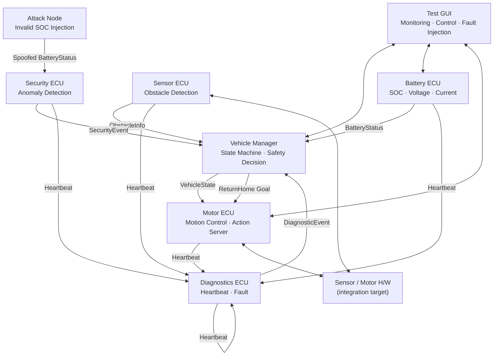
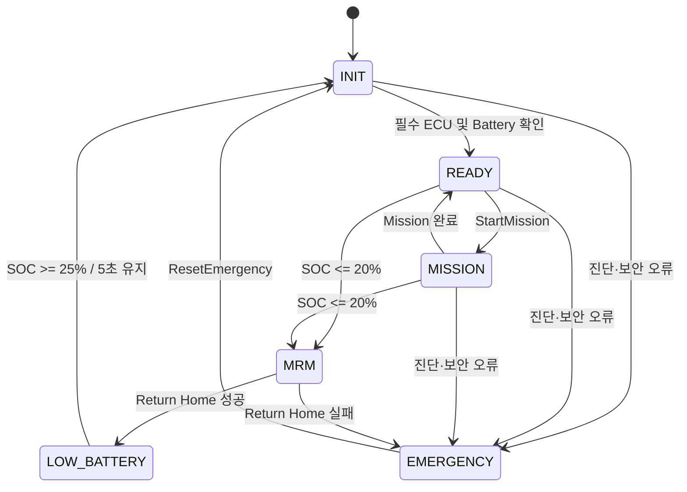

# ROS 2 SDV Fail-Safe Platform

> 분산 ECU, 상태 머신, 장애 진단 및 보안 이벤트를 통합한
> ROS 2 기반 Software-Defined Vehicle 제어 플랫폼

이 프로젝트는 차량 기능을 독립적인 ECU Node로 분리하고, 중앙
`Vehicle Manager`가 차량 상태와 안전 정책을 결정하도록 설계한 ROS 2
시뮬레이션 플랫폼입니다.

정상 주행만 구현하는 데 그치지 않고, **저전압·장애물·ECU 통신 단절·비정상
데이터**를 감지했을 때 차량이 `MRM(Minimal Risk Maneuver)` 또는
`EMERGENCY` 상태로 전환되는 전체 흐름을 구현했습니다.

현재 소프트웨어 시뮬레이션과 장애 주입 시나리오까지 검증했으며, Sensor와
Motor는 Driver 계층을 분리하여 실제 H/W 제어 코드로 교체할 수 있습니다.

---

## 핵심 구현

- 6개 ECU를 독립적인 ROS 2 Node로 구성한 분산 아키텍처
- `INIT → READY → MISSION → MRM / EMERGENCY` 상태 머신
- 저전압 감지 시 자동 Return Home 및 limp mode 주행
- 장애물 감지 시 주행·Action 일시정지 후 자동 재개
- Heartbeat timeout 기반 ECU 고장 탐지
- 비정상 SOC 및 Motor 데이터 기반 보안 이벤트 탐지
- 고장 또는 보안 이벤트 수신 시 Motor Emergency Stop
- 장시간 주행 명령을 위한 비동기 ROS 2 Action
- PyQt5 기반 모니터링·제어·장애 주입 GUI
- `SimDriver / HwDriver` 분리를 통한 H/W 확장 구조

## 기술 스택

| 구분 | 기술 |
|---|---|
| Middleware | ROS 2 Jazzy, DDS |
| Language | Python 3.12 |
| Communication | Topic, Service, Action |
| Concurrency | MultiThreadedExecutor, ReentrantCallbackGroup |
| GUI | PyQt5 |
| Build | colcon, ament_python, ament_cmake |
| Platform | Ubuntu 24.04 |

---

## 시스템 아키텍처



### ECU별 책임

| Node | 책임 |
|---|---|
| Vehicle Manager | 차량 상태 머신, 미션 수명주기, MRM 및 최종 안전 판단 |
| Battery ECU | SOC·전압·전류 발행, 저전압 시나리오 제공 |
| Sensor ECU | 장애물 정보 발행, 센서 캘리브레이션, Driver 추상화 |
| Motor ECU | 상태별 속도 정책, Pose 갱신, 이동 Action, Emergency Stop |
| Diagnostics ECU | ECU Heartbeat 감시, timeout 판정, fault 저장·조회 |
| Security ECU | Battery·Motor·Vehicle 데이터 유효성 검사 및 공격 이벤트 발행 |
| Test GUI | 차량 상태 시각화, 미션·Action 제어, 센서·배터리 시뮬레이션 |
| Attack Node | SOC 150% 메시지를 발행하는 보안 테스트용 공격 노드 |

---

## 상태 머신과 Fail-Safe 정책



| 상태 | `mission_active` | Motor 정책 |
|---|---:|---|
| READY | false | 정지 |
| MISSION | true | 정상 속도 `0.4 m/s` |
| MISSION | false | 장애물 해제까지 정지 |
| LOW_BATTERY | true | limp mode `0.1 m/s` |
| MRM | true | 원점까지 자동 복귀 |
| FAULT / EMERGENCY | 무관 | 즉시 정지 |

### 저전압 MRM 시나리오

1. Battery SOC가 20% 이하로 내려가면 Vehicle Manager가 `MRM`으로 전환합니다.
2. `/return_home` Action Goal을 Motor ECU에 비동기로 전송합니다.
3. Motor ECU는 속도를 `0.1 m/s`로 제한하고 원점 `(0, 0)`으로 이동합니다.
4. 장애물이 감지되면 Action과 주행을 정지하고, 해제 후 이어서 수행합니다.
5. 복귀 성공 시 `LOW_BATTERY`로 대기합니다.
6. Goal 거부·실행 실패·재시도 초과 시 `EMERGENCY`로 전환합니다.

### 왜 Service가 아니라 Action인가?

Return Home은 요청 즉시 완료되는 RPC가 아니라, 목표를 수락한 후 수 초 이상
독립적으로 실행되는 작업입니다. 따라서 다음 요구사항을 기준으로 Action을
선택했습니다.

- 명령 수락과 실제 작업 완료를 분리
- Executor를 점유하지 않는 비동기 결과 처리
- 실행 중 취소 및 안전 상태에 따른 중단
- 성공·실패·취소 상태 구분
- 이동 진행률 Feedback 제공 및 향후 잔여 거리 확장

진행률 표시는 부가 기능이며, 핵심 선택 기준은 **장시간 작업의 수명주기와
최종 완료 여부를 명시적으로 관리할 수 있는가**입니다.

---

## ROS 2 인터페이스

### Topics

| Topic | Publisher | 용도 |
|---|---|---|
| `/ecu/vehicle/status` | Vehicle Manager | 차량 상태와 미션 활성 여부 |
| `/ecu/battery/status` | Battery ECU | SOC, 전압, 전류 |
| `/ecu/obstacle/info` | Sensor ECU | 장애물 탐지, 거리, 각도 |
| `/ecu/motor/status` | Motor ECU | 목표·현재 선속도/각속도, 활성 상태 |
| `/ecu/vehicle/pose` | Motor ECU | 시뮬레이션 차량 위치 |
| `/ecu/heartbeat` | 각 ECU | ECU 생존 상태 |
| `/ecu/diagnostics/event` | Diagnostics ECU | fault 및 timeout 이벤트 |
| `/ecu/security/event` | Security ECU | 비정상 데이터 탐지 이벤트 |

### Services

| Service | Server | 용도 |
|---|---|---|
| `/ecu/vehicle/start_mission` | Vehicle Manager | 미션 시작 |
| `/ecu/vehicle/complete_mission` | Vehicle Manager | 미션 완료 처리 |
| `/ecu/vehicle/reset_emergency` | Vehicle Manager | EMERGENCY 해제 및 재초기화 |
| `/ecu/sensor/calibrate` | Sensor ECU | 센서 캘리브레이션 |
| `/ecu/diagnostics/get_fault_info` | Diagnostics ECU | 현재 fault 조회 |
| `/ecu/diagnostics/clear_fault` | Diagnostics ECU | fault 초기화 |

### Actions

| Action | Server | Goal | Feedback | Result |
|---|---|---|---|---|
| `/go_to_target` | Motor ECU | 목표 `x`, `y` | 진행률 | 성공 여부 |
| `/return_home` | Motor ECU | 복귀 시작 | 진행률 | 성공 여부 |

---

## 장애 감지와 안전 대응

### ECU 통신 단절

각 ECU는 1초 주기로 Heartbeat를 발행합니다. Diagnostics ECU는 필수 ECU의
Heartbeat가 3초 이상 수신되지 않으면 ERROR 이벤트를 발행하고, Vehicle
Manager는 이를 수신하여 `EMERGENCY`로 전환합니다.

```text
Sensor ECU 종료
  → Heartbeat timeout
  → DiagnosticEvent(ERROR)
  → Vehicle Manager: EMERGENCY
  → Motor ECU: emergency_stop()
```

### 비정상 데이터 공격

Security ECU는 주요 Topic의 값 범위와 상태 일관성을 검사합니다.

- SOC: `0–100%`
- Voltage: `0–80V`
- Current: 절댓값 `500A` 이하
- Motor 속도 범위 및 disabled 상태에서의 비정상 속도
- 유효하지 않은 Vehicle State

Attack Node가 SOC 150% 메시지를 발행하면 Security Event가 생성되고,
Vehicle Manager가 `EMERGENCY`로 전환됩니다.

---

## 실행 방법

### 환경

- Ubuntu 24.04
- ROS 2 Jazzy
- Python 3.12
- PyQt5

```bash
source /opt/ros/jazzy/setup.bash

cd ~/dev/sdv_platform_ws
rosdep install --from-paths src --ignore-src -r -y
colcon build --symlink-install
source install/setup.bash
```

전체 시스템 실행:

```bash
ros2 launch sdv_bringup sdv_system.launch.py
```

GUI 없이 실행:

```bash
ros2 launch sdv_bringup sdv_system.launch.py gui:=false
```

특정 ECU를 제외하거나 Driver mode를 지정할 수 있습니다.

```bash
ros2 launch sdv_bringup sdv_system.launch.py \
  gui:=false \
  security:=false \
  sensor_driver_mode:=sim \
  motor_driver_mode:=sim
```

### CLI 동작 확인

```bash
# 미션 시작
ros2 service call /ecu/vehicle/start_mission \
  sdv_interfaces/srv/StartMission "{}"

# 목표 위치 이동
ros2 action send_goal /go_to_target \
  sdv_interfaces/action/GoToTarget "{x: 1.0, y: 1.0}" \
  --feedback

# 차량 상태 확인
ros2 topic echo /ecu/vehicle/status

# fault 확인
ros2 service call /ecu/diagnostics/get_fault_info \
  sdv_interfaces/srv/GetFaultInfo "{}"
```

---

## 검증 시나리오

| 시나리오 | 입력 | 기대 결과 |
|---|---|---|
| 정상 주행 | Start Mission | `READY → MISSION`, Motor 가속 |
| 장애물 대응 | 장애물 감지 | 정지 후 장애물 해제 시 미션 재개 |
| 저전압 MRM | SOC 20% 이하 | `MRM`, limp mode Return Home |
| ECU Failure | Sensor ECU 종료 | 약 3초 후 `EMERGENCY`, Motor 정지 |
| Cyber Attack | SOC 150% 발행 | Security Event, `EMERGENCY` |
| Action 취소 | 실행 중 cancel | Motor 정지, `CANCELED` 결과 |

빌드 및 패키지 테스트:

```bash
colcon test
colcon test-result --verbose
```

상세 구현·시연 결과는
[구현 및 시연 결과 보고서](docs/SDV_PLATFORM_IMPLEMENTATION_AND_DEMO_REPORT.md)에서
확인할 수 있습니다.

---

## H/W 확장 구조

Sensor와 Motor 제어는 Node 로직과 Driver 구현을 분리했습니다.

```text
SensorNode ── SensorDriverBase ── SimSensorDriver
                              └── HwSensorDriver

MotorNode  ── MotorDriverBase  ── SimMotorDriver
                              └── HwMotorDriver
```

Launch parameter의 `driver_mode`를 통해 `sim`과 `hw` 구현을 선택합니다.
현재 `HwSensorDriver`와 `HwMotorDriver`는 교체 지점을 제공하는 단계이며,
실제 Mentor Pi M1 통신·센싱 로직과 HIL 검증은 다음 통합 범위입니다.

---

## 프로젝트에서 보여주는 역량

- ROS 2 Topic·Service·Action을 목적에 맞게 구분한 인터페이스 설계
- 분산 Node의 상태를 통합하는 차량 상태 머신 설계
- Future callback 기반 비동기 Action 처리
- Heartbeat, timeout, retry를 활용한 fault-tolerant 제어
- 진단과 보안을 최종 안전 동작까지 연결한 Fail-Safe 설계
- 시뮬레이션과 실제 H/W 구현을 분리한 Driver 추상화
- 정상 경로뿐 아니라 실패 주입 시나리오를 포함한 시스템 검증

## 패키지 구성

```text
src/
├── sdv_interfaces/     # Custom Message, Service, Action
├── vehicle_manager/    # State machine and safety decision
├── battery_ecu/        # Battery status
├── sensor_ecu/         # Obstacle sensing and sensor driver
├── motor_ecu/          # Motion policy, motor driver and Action server
├── diagnostics_ecu/    # Heartbeat and fault management
├── security_ecu/       # Runtime anomaly detection
├── attack_node/        # Security test traffic generator
├── sdv_test_gui/       # PyQt5 test and monitoring GUI
└── sdv_bringup/        # Integrated launch
```

## 현재 상태

- [x] 분산 ECU 및 Custom Interface 구현
- [x] 차량 상태 머신과 미션 제어
- [x] 장애물 정지·재개
- [x] 저전압 MRM 및 Return Home
- [x] Heartbeat fault detection
- [x] Runtime security detection
- [x] GUI 및 장애 주입 시연
- [x] Sim Driver 기반 통합 검증
- [ ] 실제 Sensor/Motor H/W 제어 구현
- [ ] HIL 기반 반복·지연·안전 정지 검증
