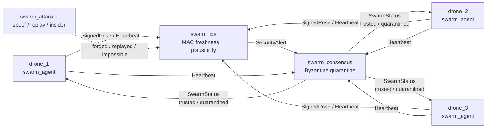
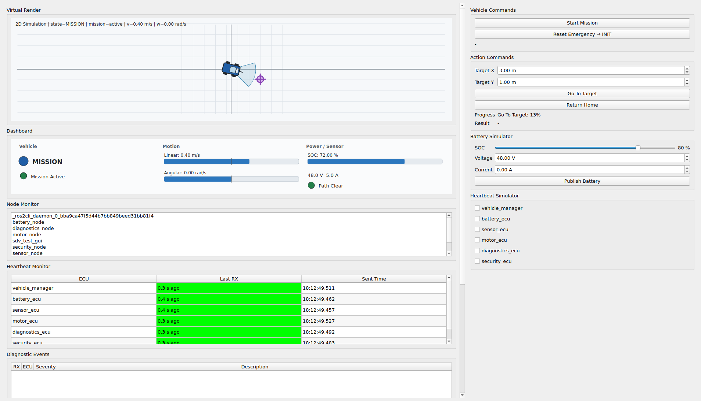
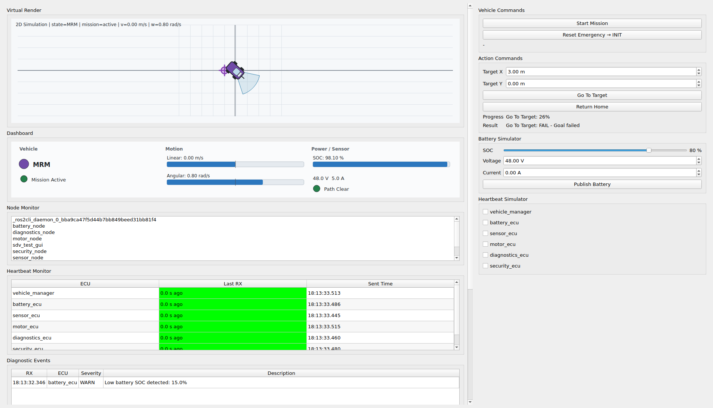
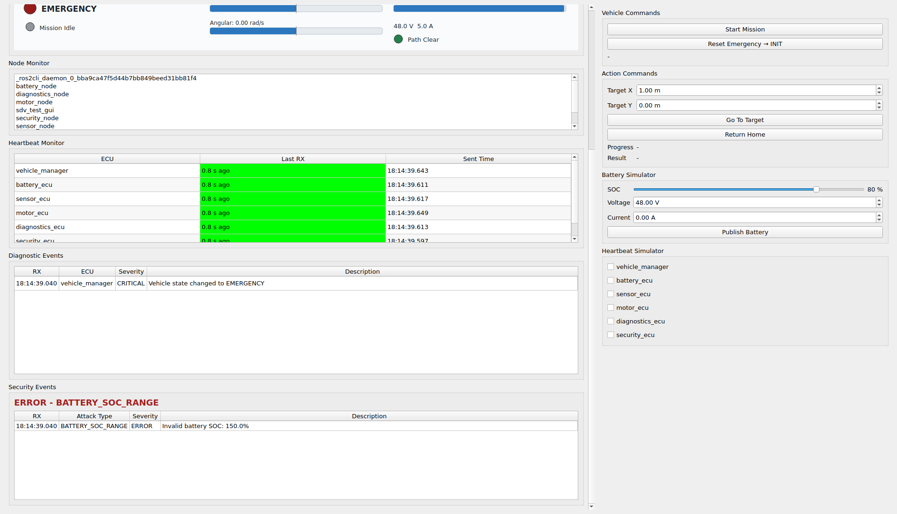

# Sentinel Swarm

> 보안 내성형 자율 드론 군집 시스템
> Security-Resilient Autonomous Drone Swarm

GPS 없는 환경에서 카메라+IMU만으로 자기위치를 추정하고, Jetson Edge AI로
객체를 인식하며, 서로 통신해 탐색 영역을 나누는 드론 군집. **단, 통신 계층에
인증·침입탐지를 넣어 스푸핑/악성 노드가 있어도 군집이 무너지지 않는다.**

이 프로젝트의 차별점은 SLAM/YOLO 자체가 아니라 — 그건 누구나 한다 —
**「보안·안전(ISO 21434, SecOC, CAN IDS)을 아는 자율비행 엔지니어」** 라는
조합이다. 차량 보안에서 쓰던 SecOC 메시지 인증과 침입탐지(IDS)를 실제 ROS 2
드론 군집 통신(DDS)에 그대로 이식했고, 그것이 코드로 증명된다.

전체 기획은
[개발 기획서](docs/SENTINEL_SWARM_DEVELOPMENT_PLAN.docx)를 참고.

---

## 5단계 로드맵

| 단계 | 내용 | 공고 매핑 | 상태 |
|---|---|---|:--:|
| **1** | **ROS 2 + PX4 SITL + Gazebo 단일 드론 Offboard 비행** | **PID / Control** | 🟡 |
| **2** | **VIO/EKF GPS-denied 위치추정 + 장애물 회피** | **VIO, GPS-Denied Nav** | 🟡 |
| **3** | **Jetson YOLO 실시간 추론(TensorRT) → 회피 경로 반영** | **Object Detection, Jetson** | 🟡 |
| **4** | **Multi-drone 군집: DDS 위치 공유·영역 분배·충돌 회피** | **Swarm Coordination** | ✅ |
| **5** | **SROS2 인증 + IDS + Byzantine 합의 격리 (차별점)** | **Drone-to-Drone, 신뢰성** | ✅ |

> ✅ 구현·검증 완료 · 🟡 코드 구현 (PX4 SITL 통합 검증 전) · ⬜ 예정

**5단계(보안 내성 레이어)를 먼저 구현**했다 — 군집 통신의 신뢰·인증·이상탐지가
본 지원자의 본업 영역이고 가장 강한 차별점이기 때문이다. 이어서 **1단계(단일 드론
Offboard 비행)**, **2단계(GPS-denied 위치추정 + 회피)**, **3단계(Jetson YOLO →
회피 반영)**, **4단계(다중 드론 군집 좌표화)** 까지 구현해 1→5단계가 한 시스템으로 꿰인다.

> **기반 자산(Heritage).** 이 시스템은 백지에서 시작하지 않았다. 분산 ECU·상태머신·
> 런타임 IDS·공격 노드를 갖춘 [ROS 2 SDV Fail-Safe Platform](#sdv-foundation)을
> 드론 군집으로 진화시킨 것이다. `security_ecu → swarm_ids`,
> `attack_node → swarm_attacker`로 검증 로직과 공격 시나리오 패턴이 그대로 이어진다.

---

## 실연동 검증 (ROS 2 Humble)

Ubuntu 22.04 + ROS 2 Humble에서 실제로 빌드·테스트·실행해 확인한 결과:

| 항목 | 결과 |
|---|---|
| `colcon build` (전체 25 패키지) | ✅ 25/25 (메시지 생성 cmake 3개 포함) |
| `colcon test` (알고리즘 6 패키지) | ✅ **53 tests, 0 failures** |
| Phase 4 런타임 (4-drone) | ✅ 4 드론 + consensus, 전원 trusted, `/swarm/pose` 40 Hz |
| Phase 5 런타임 (insider_teleport) | ✅ `drone_3` TELEPORT 탐지 → 격리, trusted = `[drone_1, drone_2]` |

Phase 5 공격 데모 실측 출력:

```text
$ ros2 launch swarm_bringup swarm_security.launch.py attack:=insider_teleport
# /swarm/security_alert :  3× {suspect_id: drone_3, alert_type: TELEPORT}
# /swarm/status         :  trusted=[drone_1, drone_2]  quarantined=[drone_3]
```

순수 ROS 2/DDS인 **4·5단계는 실행까지 검증 완료**. 1~3단계는 위 빌드로 패키지·노드·
메시지가 Humble에서 정상 빌드됨을 확인했고, PX4 SITL/Gazebo·VIO·Jetson 추론 노드와의
실연동 비행 검증만 남아 🟡로 둔다.

---

## Phase 1 — 단일 드론 Offboard 비행 (코드 구현, Humble 빌드 확인)

PX4 SITL + Gazebo 위에서 MAVROS로 단일 드론을 Offboard 제어한다. 공고의
**"PID / Control System"** 을 직접 보여주기 위해, 단순 위치 setpoint가 아니라
**위치 오차 → 속도 setpoint를 축별 PID로 생성**하는 웨이포인트 추종기로 구현했다.

### 동작

```text
WAIT_FCU → PREFLIGHT → MISSION → LANDING → DONE
```

1. **WAIT_FCU** — `/mavros/state`의 `connected`를 기다린다.
2. **PREFLIGHT** — OFFBOARD 유지 조건(>2 Hz setpoint 스트림)을 만족시키기 위해
   setpoint를 일정 시간 흘린 뒤, `OFFBOARD` 모드 요청 → 시동(arm).
3. **MISSION** — 각 웨이포인트로 PID 속도 제어. 도달 반경 안에 들면 다음으로 진행.
4. **LANDING** — 마지막 웨이포인트 후 `AUTO.LAND`, 시동 해제되면 완료.

기본 미션은 고도 3 m에서 한 변 5 m 정사각형 비행이다. 좌표·프레임은 ENU
(x=East, y=North, z=Up) 기준으로 MAVROS 관례를 따른다.

### 패키지

| 패키지 | 역할 |
|---|---|
| `drone_offboard` | PID 제어기(`pid.py`) + MAVROS Offboard 비행 상태머신 |
| `drone_bringup` | Offboard 노드 + (옵션) MAVROS 통합 launch |

### 실행

```bash
# 터미널 1 — PX4 SITL + Gazebo
cd ~/PX4-Autopilot && make px4_sitl gz_x500

# 터미널 2 — MAVROS + Offboard 컨트롤러
source /opt/ros/humble/setup.bash
source install/setup.bash
ros2 launch drone_bringup drone.launch.py mavros:=true
```

PID 게인을 런타임에 바꿔 튜닝을 시연할 수 있다:

```bash
ros2 launch drone_bringup drone.launch.py mavros:=true \
  kp_xy:=1.2 ki_xy:=0.05 kd_xy:=0.25
```

PID 로직은 ROS 없이도 단위 테스트로 검증된다:

```bash
colcon test --packages-select drone_offboard
```

> 상태 🟡: 노드·PID는 구현·단위테스트 완료. PX4 SITL/Gazebo 실연동 비행 검증은
> Ubuntu 22.04 + ROS 2 Humble + PX4-Autopilot 환경에서 수행 예정.

---

## Phase 2 — GPS-denied 위치추정 + 장애물 회피 (코드 구현)

GPS가 막히거나 **스푸핑**될 때 카메라+IMU 기반 VIO로 위치추정을 이어가고, 경로상
장애물을 반응형으로 회피한다. Sentinel Swarm답게 **GPS 스푸핑을 공격으로 보고
탐지→VIO 폴백**으로 연결해, 2단계가 5단계 보안 서사와 이어진다.

### 위치추정 — VIO/GPS 융합 + GPS 무결성 모니터

- **Kalman 융합** (`ekf.py`): 등속 모델 6-state 칼만 필터로 VIO·GPS 위치 융합.
  ROS의 robot_localization EKF가 일반화하는 선형 코어를 numpy로 직접 구현.
- **GPS 무결성 모니터** (`gps_monitor.py`): 각 GPS fix를 필터 예측과 비교(innovation).
  정상 fix는 예측에 가깝고, 스푸핑/드리프트 fix는 벌어진다. innovation이 게이트를
  연속 초과하면 GPS를 기각하고 **VIO 단독(GPS-denied) 모드로 폴백**한다. 히스테리시스
  (trip/recover streak)로 단발 노이즈에 흔들리지 않는다 — 차량 CAN IDS의 타당성
  게이트를 항법 센서에 적용한 것.
- 모드는 `/drone/localization_status`(`LocalizationStatus`)로 발행: `GPS_FUSED` ↔ `GPS_DENIED`.

### 회피 — 포텐셜 필드

- **`potential_field.py`**: 목표로의 인력 + 장애물로부터의 척력을 합성한 속도 명령.
  LaserScan 빔을 영향 반경 내 장애물로 변환해 반응형 회피. 도착 반경 안에선 정지.

### 패키지

| 패키지 | 역할 |
|---|---|
| `drone_interfaces` | `LocalizationStatus.msg` (GPS-denied/VIO 폴백 상태) |
| `drone_localization` | Kalman VIO/GPS 융합 + GPS 스푸핑 모니터 |
| `drone_avoidance` | 포텐셜 필드 반응형 회피 |

### 토픽

```text
sub  /vio/odom (Odometry)   /gps/pose (PoseStamped)   /scan (LaserScan)
pub  /drone/odom (Odometry)                 # 융합 추정
pub  /drone/localization_status             # GPS_FUSED | GPS_DENIED
pub  /drone/avoidance_cmd (TwistStamped)    # 회피 속도 명령
```

### 실행

```bash
# VIO/GPS/LaserScan 소스(PX4 SITL+Gazebo 또는 bag)가 떠 있는 상태에서
ros2 launch drone_bringup phase2_navigation.launch.py goal_x:=8.0 goal_y:=2.0

# GPS 스푸핑 폴백 관측
ros2 topic echo /drone/localization_status
```

알고리즘 코어는 ROS 없이 단위 테스트된다 (칼만 융합·스푸핑 탐지·포텐셜 필드):

```bash
colcon test --packages-select drone_localization drone_avoidance
```

### Phase 1 연동 (closed loop)

Phase 1 컨트롤러를 `use_avoidance:=true`로 띄우면 **위치추정 → 회피 → 비행**이
한 루프로 닫힌다:

```bash
ros2 launch drone_bringup phase2_navigation.launch.py
ros2 launch drone_bringup drone.launch.py mavros:=true use_avoidance:=true
```

- 컨트롤러는 현재 웨이포인트를 `/goal_pose`로 발행 → 회피 노드의 목표가 됨
- 회피 노드는 장애물을 반영한 수평 속도를 `/drone/avoidance_cmd`로 발행
- 컨트롤러는 그 수평 속도를 setpoint로 사용하고, 고도는 자체 PID로 유지

> 상태 🟡: 필터·모니터·회피 코어는 구현·단위테스트(19건) 완료, Phase 1 연동 배선 완료.
> VIO 소스 연동과 SITL 실연동 검증은 Humble + PX4 환경에서 수행 예정. (VIO 자체는
> 상위 패키지/시뮬 제공, 본 노드는 `/vio/odom`을 소비)

---

## Phase 3 — Jetson YOLO 인지 → 회피 반영 (코드 구현)

Jetson에서 실시간 추론한 **YOLO 객체 탐지**를 항법에 반영한다. VIO와 같은 원칙으로,
**YOLO+TensorRT 추론 자체는 상위 노드**가 `vision_msgs/Detection2DArray`로 발행하고,
본 단계는 **탐지 → 항법 장애물로 변환하는 알고리즘 브릿지**(알고리즘 엔지니어가 실제로
맡는 부분)에 집중한다.

### 탐지 → 장애물 기하 변환

- **`detection_geometry.py`** (핀홀 모델): 바운딩박스의 픽셀 열 → bearing, 박스 높이 →
  거리(`distance = real_size · f / size_px`), 둘을 합쳐 상대 위치(전방 x, 좌 y, REP-103).
- **`perception_node.py`**: `/detections`를 소비해 각 객체의 거리를 추정·투영하고, 융합
  오도메트리(`/drone/odom`)로 월드 좌표로 변환해 `/perception/obstacles`(`PoseArray`)로 발행.
  yaw=0 가정으로 body↔world ENU 정렬 (Phase 1/2와 동일).
- **회피 연동**: `drone_avoidance`가 `/perception/obstacles`를 LaserScan 장애물과 **병합**해
  포텐셜 필드에 함께 반영 → 탐지한 물체를 회피 경로에 즉시 반영.

### 패키지

| 패키지 | 역할 |
|---|---|
| `drone_perception` | YOLO `Detection2DArray` → 월드 장애물 `PoseArray` 변환 |

### 실행

```bash
# 상위 YOLO 노드가 /detections (vision_msgs/Detection2DArray)를 발행하는 상태에서
ros2 launch drone_bringup phase3_perception.launch.py hfov_deg:=86.0

# Phase 2 항법(localization+avoidance)을 포함해 함께 기동됨
ros2 topic echo /perception/obstacles
```

기하 변환 코어는 ROS 없이 단위 테스트된다:

```bash
colcon test --packages-select drone_perception
```

> 상태 🟡: 탐지→장애물 기하 코어는 구현·단위테스트(7건) 완료, 회피 병합 배선 완료.
> YOLO+TensorRT 추론 노드 연동과 Jetson 온보드 실측은 실HW 단계. (추론 자체는 상위
> 노드 제공, 본 노드는 `/detections`를 소비)

---

## Phase 4 — 다중 드론 군집 좌표화 (구현 완료)

여러 드론이 정사각형 탐색 영역을 **분배**하고 각자 **lawnmower 커버리지 경로**로
탐색하며, DDS로 위치를 공유하고 서로 **충돌을 회피**한다. 순수 ROS 2 / DDS로 동작해
PX4 없이 시연 가능하다. **4단계는 군집 좌표화, 5단계는 그 위에 얹는 보안**이라는 층
구조다 — 5단계의 `swarm_agent`/`swarm_consensus`가 사용하던 좌표화 로직을 테스트 가능한
라이브러리로 분리해 4단계로 정식화했다.

### 좌표화 알고리즘 (`swarm_coordination`, 라이브러리)

- **영역 분배** (`allocation.py`): 신뢰 집합을 받아 각 드론이 동일 함수로 **결정론적·
  서로소** 분할을 도출 — 추가 합의 라운드 없이 일관된 분배. 멤버가 빠지거나 격리되면
  영역이 자동 재분할. (수직 스트립 + 근정사각 그리드)
- **커버리지 경로** (`coverage.py`): 할당된 셀을 boustrophedon(lawnmower) 패스로 덮는
  웨이포인트 생성 — 호버가 아니라 실제로 영역을 "탐색".
- **충돌 회피** (`collision.py`): 분리 반경 내 이웃으로부터 반발 속도를 더해 최소 간격
  유지. 모든 드론이 대칭으로 적용 → 사실상 상호(reciprocal) 회피.

### 통합

`swarm_agent`가 이 라이브러리를 사용하도록 리팩터됨: 신뢰 집합 → 섹터 분배 →
커버리지 경로 추종 → 충돌 회피 속도. 멤버십이 바뀌면 섹터·경로를 자동 재생성한다.

### 실행

```bash
# 4대 군집이 영역을 나눠 탐색 (RViz로 관측)
ros2 launch swarm_bringup swarm_coordination.launch.py drones:=4 viz:=true

# 멤버 수를 바꿔 좌표화 스케일 관측
ros2 launch swarm_bringup swarm_coordination.launch.py drones:=6 viz:=true
```

좌표화 알고리즘은 ROS 없이 단위 테스트된다 (분배·커버리지·충돌, 12건):

```bash
colcon test --packages-select swarm_coordination
```

> 상태 ✅: 순수 ROS 2/DDS로 동작·시연 가능. 알고리즘 12건 단위 테스트 + 통합 실행.

---

## Phase 5 — 보안 내성 레이어 (구현 완료)

순수 ROS 2 / DDS만으로 동작한다. PX4·Gazebo 없이도 군집 통신 보안 스토리를
독립적으로 시연할 수 있도록 설계했다.

### 핵심 아이디어 — 2계층 방어

차량 CAN IDS 실무와 동일한 2계층 구조다.

1. **암호 계층 (SecOC식 메시지 인증)** — 모든 군집 메시지는 freshness 값(단조
   증가 카운터, anti-replay)과 truncated HMAC-SHA256 MAC을 싣는다. 그룹 대칭키를
   모르는 **외부자**의 위조와 캡처한 프레임의 **재전송**을 차단한다.
2. **타당성 계층 (IDS plausibility)** — 디코딩된 상태에 범위·발행 주기·텔레포트
   검사를 적용한다. 그룹키를 가진 **내부자(탈취 노드)** 가 MAC은 유효하지만
   물리적으로 불가능한 상태를 주장하면 잡아낸다.

탐지된 악성 노드는 **Byzantine 합의 가드**가 정족수(quorum)와 지속 증거
임계치를 모두 만족할 때 격리하고, 갱신된 신뢰 집합을 발행한다. 정직한 에이전트는
이 집합으로 탐색 영역을 재분배 — 별도 조정 라운드 없이 오염 노드가 빠진 채
영역이 다시 나뉜다.

### 아키텍처



### 패키지

| 패키지 | 역할 | SDV 자산 계승 |
|---|---|---|
| `swarm_interfaces` | SignedPose·SwarmHeartbeat·SecurityAlert·ConsensusVote·SwarmStatus | `sdv_interfaces` |
| `swarm_security` | SecOC식 MAC·freshness 검증 라이브러리 (노드 아님) | HSE/SecOC 개념 |
| `swarm_agent` | 인증된 pose 발행 + 신뢰 집합 기반 섹터 자동 분배 | `motor_ecu` 모션 |
| `swarm_ids` | MAC/freshness 검증 + 범위·주기·텔레포트 탐지 | `security_ecu` |
| `swarm_consensus` | 정족수·지속증거 기반 격리 + 신뢰 집합 발행 | `diagnostics_ecu` |
| `swarm_attacker` | 외부자 위조 / 재전송 / 내부자 텔레포트 주입 | `attack_node` |
| `swarm_viz` | 군집 상태 → RViz MarkerArray (신뢰/섹터/경보) | `sdv_test_gui` |
| `swarm_bringup` | 시나리오별 통합 launch (+ RViz) | `sdv_bringup` |

### 실행

```bash
source /opt/ros/humble/setup.bash
cd ~/dev/sdv_platform_ws
colcon build --symlink-install
source install/setup.bash

# 정상 군집 (3대, 공격 없음)
ros2 launch swarm_bringup swarm_security.launch.py

# 공격 시나리오
ros2 launch swarm_bringup swarm_security.launch.py attack:=outsider_spoof
ros2 launch swarm_bringup swarm_security.launch.py attack:=replay
ros2 launch swarm_bringup swarm_security.launch.py attack:=insider_teleport
```

관측 (CLI):

```bash
ros2 topic echo /swarm/security_alert      # IDS 탐지 이벤트
ros2 topic echo /swarm/status              # trusted / quarantined 집합
```

### RViz 시각화

`viz:=true`를 붙이면 `swarm_viz` 노드와 RViz가 함께 뜬다. 군집 상태를
`visualization_msgs/MarkerArray`로 변환해 위에서 내려다보는 뷰로 보여준다.

```bash
ros2 launch swarm_bringup swarm_security.launch.py attack:=insider_teleport viz:=true
```

화면 구성:

- **드론 구체** — 색으로 신뢰 상태 표시: 🟢 trusted · 🟠 탐지 직후(경보) · 🔴 격리(quarantined)
- **탐색 영역 경계**와 **섹터 분할선** — 신뢰 집합 크기에 따라 자동 재분할 (격리 시 분할선이 줄어듦)
- **경보 배너** — 최신 IDS 탐지(`[TELEPORT] drone_3` 등)를 상단에 표시, 평상시 `swarm nominal`

`insider_teleport` 데모에서는 `drone_3`이 두 지점을 순간이동하는 게 보이고 →
🟠로 깜빡이다 → 격리되며 🔴로 바뀌고 → 섹터 분할선이 2분할로 재구성되는 흐름을
한눈에 볼 수 있다.

> `swarm_viz`는 MAC을 검증하지 않는 순수 모니터다. 발행된 pose를 그대로 그리므로
> 스푸핑된 위치도 화면에 나타나며, IDS 탐지/격리 결과는 색으로 구분된다.

### 검증 시나리오

| 공격 모드 | 공격 내용 | IDS 탐지 | 합의 결과 |
|---|---|---|---|
| `outsider_spoof` | 그룹키 없는 위조 pose | `MAC_INVALID` | 미인증 → 무시 |
| `replay` | 캡처한 정상 pose 재전송 | `REPLAY` | 재전송 차단 |
| `insider_teleport` | 탈취 노드의 불가능한 텔레포트 | `TELEPORT` | 노드 격리 → 영역 재분배 |

`insider_teleport`에서는 `drone_3`이 탈취 노드 역할을 하며, IDS가 `TELEPORT`를
반복 탐지 → 합의 가드가 정족수·지속증거 충족 시 `drone_3`을 격리 → `SwarmStatus`의
trusted 집합이 `[drone_1, drone_2]`로 줄고 두 노드가 탐색 영역을 다시 나눈다.

---

## 기술 스택

| 구분 | 기술 |
|---|---|
| Middleware | ROS 2 Humble (Ubuntu 22.04, LTS) |
| Flight Stack | PX4 SITL + Gazebo (1~4단계) |
| Bridge | MAVROS |
| Localization | VIO + EKF (robot_localization) — 2단계 |
| Edge AI | Jetson Orin Nano Super + TensorRT — 3단계 |
| Object Detection | YOLO11 / YOLOv8 — 3단계 |
| 통신 / 보안 | Fast DDS + SROS2 (DDS-Security, X.509), SecOC식 앱계층 MAC |
| Language | Python 3.10 (+ 일부 C++) |
| Build | colcon, ament_python / ament_cmake |

> Humble 채택 이유: PX4/MAVROS 및 드론 생태계 튜토리얼 대다수가 Humble(22.04)
> 기준이라 호환성·자료 측면에서 유리하다. (SDV 기반은 Jazzy였으나 드론 통합을
> 위해 Humble로 정렬)

---

## MVP 범위

전체 5단계는 4~6개월 규모다. 시간이 부족하면 최소 버전만으로도 스토리가 완성된다:

- 1·2단계 — GPS-denied 단일 자율비행 (VIO + 회피)
- 4단계 라이트 — SITL 2대 통신
- **5단계 핵심 — SROS2 인증 + IDS (현재 저장소에 구현 완료)**

Jetson 실HW와 5대 군집은 확장 계획으로 둔다.

---

## 빌드 및 테스트

```bash
colcon build --symlink-install
source install/setup.bash

# SecOC 인증 라이브러리 단위 테스트
colcon test --packages-select swarm_security
colcon test-result --verbose
```

`swarm_security`의 단위 테스트는 MAC 왕복 검증, 잘못된 키/신원/freshness 거부,
재전송 탐지를 포함한다.

---

<a name="sdv-foundation"></a>
## 부록 — SDV Fail-Safe Platform (기반 자산)

Sentinel Swarm은 아래 ROS 2 SDV 플랫폼에서 출발했다. 분산 ECU, 차량 상태머신,
Heartbeat 고장 탐지, 런타임 보안 이벤트, 장애 주입 GUI를 갖춘 시뮬레이션
플랫폼이며, 그 보안·Fail-Safe 자산이 Phase 5의 직접적인 토대가 되었다.



<table>
  <tr>
    <td width="50%">
      
    </td>
    <td width="50%">
      
    </td>
  </tr>
  <tr>
    <td align="center"><strong>Low Battery MRM</strong></td>
    <td align="center"><strong>Cyber Attack Response</strong></td>
  </tr>
</table>

SDV 플랫폼 자체의 분산 ECU 아키텍처, 상태머신, Fail-Safe 정책, ROS 2
Topic/Service/Action 인터페이스 설계 상세는
[구현 및 시연 결과 보고서](docs/SDV_PLATFORM_IMPLEMENTATION_AND_DEMO_REPORT.md)에서
확인할 수 있다.

### SDV → Swarm 진화 매핑

| SDV (기반) | Sentinel Swarm (진화) |
|---|---|
| `security_ecu` 데이터 유효성 검사 | `swarm_ids` 군집 메시지 IDS |
| `attack_node` 스푸핑 주입 | `swarm_attacker` 위조/재전송/내부자 |
| `vehicle_manager` 상태머신 | 드론 비행/군집 상태 조정 |
| `diagnostics_ecu` Heartbeat/timeout | `swarm_consensus` 노드 생존·신뢰도 |
| `sdv_interfaces` Custom msg | `swarm_interfaces` SignedPose 등 |
| Sim/Hw Driver 추상화 | PX4 SITL ↔ 실HW 교체 지점 |
